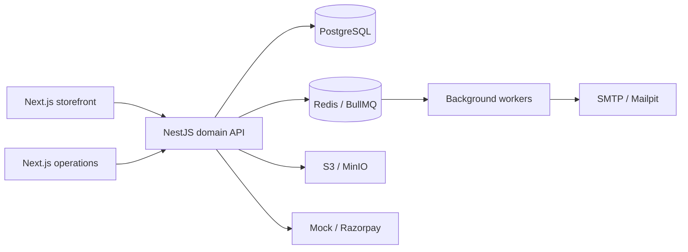

# Hunaré architecture

## Decisions

A pnpm/Turborepo monorepo contains independently deployed Next.js storefront (3000), Next.js operations portal (3001), and NestJS REST API (4000). PostgreSQL is authoritative; Redis/BullMQ handles retryable background work; S3-compatible storage holds media. The API is a modular monolith: transactions remain local, while external capabilities use provider interfaces. This avoids distributed-transaction complexity and leaves extraction boundaries for future sellers and fulfillment.

Shared packages contain database access, contracts, validation, commerce rules, UI tokens, and integration adapters. Applications never import another application's source. Prices are integer minor units, initially INR. Checkout reads current variant prices and atomically reserves inventory. Order snapshots preserve historical product details. Signed, deduplicated payment webhooks are authoritative. No client-supplied total is trusted.

## Implementation sequence

1. Workspace, design tokens, infrastructure, schema and reproducible seed.
2. API foundations, sessions/RBAC, catalog and content.
3. Transactional checkout, payment adapters, inventory and order transitions.
4. Server-rendered storefront, shopping interactions, account and checkout.
5. Admin operations, editor, content, reporting and media.
6. Security and domain tests, integration and browser verification, deployment documentation.

Each slice is checked before its dependents. Verification evidence and outstanding limitations are recorded in `docs/verification.md`; generated code is not treated as verified functionality.

## Assumptions

- Single merchant, INR, English, India delivery; sellers and currencies are extension points.
- Product photos and sample people/orders are illustrative development data.
- Mock payments are explicitly development-only and never enabled in production.
- Tax is configurable inclusive pricing; a merchant must configure tax and shipping policies before launch.
- Live payment, email, shipping and deployment credentials are supplied through environment configuration.
- No production deployment runs automatically.

## Security boundaries

The API owns authorization. Opaque sessions are stored as hashes, carried in HttpOnly SameSite cookies, expire, and rotate on renewal. Mutation requests from browsers require an allowlisted Origin. Passwords use scrypt with unique salts. Role permissions are database-backed. Every resource read checks ownership or a specific staff permission. Rate limits protect authentication and public writes. Administrative changes create audit events. Media bytes are decoded and re-encoded before publication.

## Extension points

PaymentProvider, ShippingProvider, EmailProvider, SearchProvider, StorageProvider and AnalyticsProvider isolate integrations. Personalization is schema-driven and is snapshotted onto each line item. CMS sections have explicit type, order, visibility and publish windows. Search is PostgreSQL-backed behind a provider interface. Future AI consumers call the same authorized APIs.
